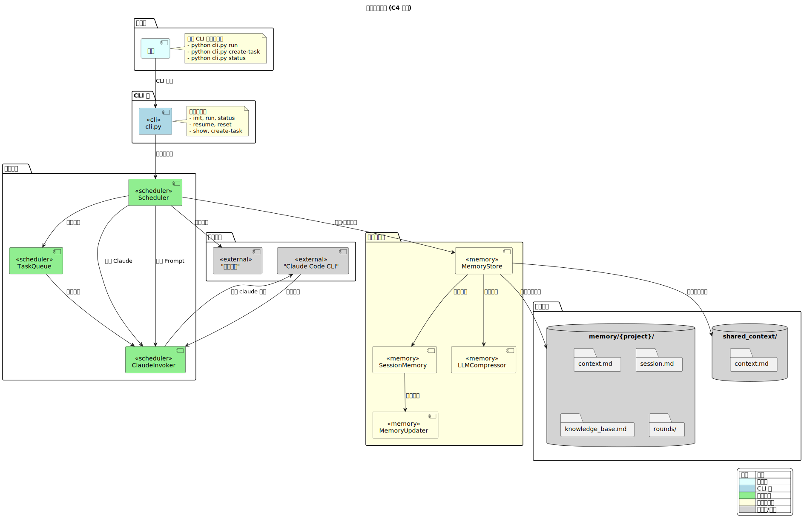

# 项目概览

## 1. 项目简介

### 什么是苦行僧（kuxing）

苦行僧（kuxing）是一个基于 **Claude Code** 的**多轮任务调度系统**，专为长期运行的任务设计。它解决了 Claude Code 单次会话限制的问题，让 Claude 能够跨会话持续执行多轮任务。

### 核心定位

```
┌─────────────────────────────────────────────────────────────┐
│                                                             │
│   Claude Code 原生限制                                       │
│   ├─ 单次会话无法超过上下文窗口                             │
│   ├─ 会话结束后记忆丢失                                     │
│   └─ 无法支持需要数百轮的长期任务                           │
│                                                             │
│   ─────────────────────────────────────────────────────────│
│                                                             │
│   kuxing 解决方案                                           │
│   ├─ 多轮调度：支持串行/并行/循环执行                       │
│   ├─ 状态持久化：每轮上下文自动保存到文件系统                │
│   ├─ 智能记忆传递：每轮自动注入历史上下文                    │
│   └─ 断点续传：中断后可从上次位置继续执行                   │
│                                                             │
└─────────────────────────────────────────────────────────────┘
```

### v0.5.0 核心创新

v0.5.0 引入了**结构化会话记忆**机制，解决了长期任务执行中的上下文丢失问题：

```
┌─────────────────────────────────────────────────────────────┐
│                 v0.5.0 结构化会话记忆                       │
├─────────────────────────────────────────────────────────────┤
│                                                             │
│  ┌─────────────────────────────────────────────────────┐  │
│  │  1. MEMORY.md 索引文件                               │  │
│  │     └─ 快速定位所需记忆，无需读取全部文件              │  │
│  └─────────────────────────────────────────────────────┘  │
│                          │                                 │
│                          ▼                                 │
│  ┌─────────────────────────────────────────────────────┐  │
│  │  2. session.md 结构化模板                           │  │
│  │     ├─ 执行标题：任务名 + 轮次                       │  │
│  │     ├─ 当前状态：进度 + 下一步计划                   │  │
│  │     ├─ 关键文件：修改/创建的文件列表                 │  │
│  │     ├─ 工作日志：每轮执行摘要                        │  │
│  │     └─ 错误与修正：遇错自动记录                      │  │
│  └─────────────────────────────────────────────────────┘  │
│                          │                                 │
│                          ▼                                 │
│  ┌─────────────────────────────────────────────────────┐  │
│  │  3. LLM 压缩集成                                    │  │
│  │     ├─ session.md > 20,000 字符 → 自动压缩        │  │
│  │     ├─ context.md > 30KB → 自动压缩                  │  │
│  │     └─ 知识沉淀 > 25KB → 自动压缩                    │  │
│  └─────────────────────────────────────────────────────┘  │
│                                                             │
└─────────────────────────────────────────────────────────────┘
```

### v0.5.0 新增功能详解

#### MEMORY.md 记忆索引系统

每次执行前先读取 MEMORY.md 索引，快速定位所需记忆文件：

```markdown
# 项目记忆索引

最后更新：2026-04-03 17:30:00

---

## 会话记忆
- [当前会话](session.md) — Round 3，正在执行文档编写

## 项目背景
- [项目信息](context.md) — 代码路径、文档路径、SDK 配置

## 知识沉淀
- [历史经验](knowledge_base.md) — 最佳实践、避坑指南

---

**使用说明**：
- 每次执行前，先读取此索引文件
- 根据任务需要，按需加载相关记忆文件
- 新增记忆时，同步更新此索引
```

#### 结构化会话记忆（10 个 Section）

| Section | 用途 | 更新频率 |
|---------|------|----------|
| **执行标题** | 任务名 + 轮次 | 每轮自动更新 |
| **当前状态** | 执行进度 + 下一步 | 每轮自动提取 |
| **任务规格** | 用户原始需求 | 初始化时 |
| **关键文件** | 修改/创建的文件列表 | 遇新文件时 |
| **工作流程** | 执行步骤 | 执行命令时 |
| **错误与修正** | 错误记录 | 遇错误时 |
| **代码库文档** | 系统理解 | 手动添加 |
| **学习总结** | 经验记录 | 学到经验时 |
| **关键结果** | 最终输出 | 任务完成时 |
| **工作日志** | 详细日志 | 每轮追加 |

#### LLM 自动压缩

防止记忆文件无限增长：

| 文件 | 大小限制 | 压缩策略 |
|------|----------|----------|
| `session.md` | 20,000 字符 | 保留当前状态，压缩日志和错误 |
| `context.md` | 30,000 字符 | 去重，保留最新信息 |
| `knowledge_base.md` | 25,000 字符 | 保留最佳实践，删除过时经验 |

### 主要功能列表

| 功能 | 说明 |
|------|------|
| 多轮执行 | 支持串行、并行、循环三种执行模式 |
| 状态持久化 | 通过文件系统保存每轮执行上下文 |
| 智能记忆 | 每轮知道之前几轮做了什么，下一轮该做什么 |
| 断点续传 | 中断后可继续，从上次位置执行 |
| 配置驱动 | 通过 YAML 配置文件定义任务流程 |
| 多项目并行 | 支持同时运行多个独立项目，每个项目有独立记忆空间 |
| 结构化会话记忆 | v0.5.0 新增，10 个结构化 section 跟踪执行状态 |
| 自动知识沉淀 | 每轮自动提取关键发现和经验 |

---

## 2. 核心特性

### 功能特性表

| 特性 | 说明 | 支持版本 |
|------|------|----------|
| **多轮执行** | 串行/并行/循环三种模式 | v0.1.0+ |
| **状态持久化** | 文件系统保存每轮上下文 | v0.1.0+ |
| **智能记忆** | 历史上下文自动传递 | v0.1.0+ |
| **断点续传** | 中断后可继续执行 | v0.1.0+ |
| **配置驱动** | YAML 定义任务流程 | v0.1.0+ |
| **多项目并行** | 独立记忆空间 | v0.2.0+ |
| **分层记忆系统** | 全局共享/项目私有/知识沉淀 | v0.2.0+ |
| **环境变量支持** | ${VAR_NAME} 语法引用环境变量 | v0.3.0+ |
| **create-task 命令** | 交互式创建任务 | v0.4.0+ |
| **自动记忆更新** | 从执行结果自动提取信息 | v0.4.0+ |
| **结构化会话记忆** | 10 个结构化 section | v0.5.0+ |
| **记忆大小控制** | 自动压缩防止膨胀 | v0.5.0+ |
| **记忆索引文件** | MEMORY.md 快速定位 | v0.5.0+ |
| **自动记忆更新** | 从 result 标签提取文件/命令/错误 | v0.5.0+ |

### 执行模式详解

```
┌─────────────────────────────────────────────────────────────┐
│                      执行模式对比                            │
├─────────────────────────────────────────────────────────────┤
│                                                             │
│  ┌─────────────┐   ┌─────────────┐   ┌─────────────┐      │
│  │   Serial    │   │  Parallel   │   │    Loop     │      │
│  ├─────────────┤   ├─────────────┤   ├─────────────┤      │
│  │  Task1      │   │  Task1 ──┐  │   │  Round 1    │      │
│  │     │       │   │  Task2 ──┼──│   │     │        │      │
│  │     ▼       │   │  Task3 ──┘  │   │     ▼        │      │
│  │  Task2      │   │             │   │  Round 2    │      │
│  │     │       │   │  同时执行    │   │     │        │      │
│  │     ▼       │   │             │   │     ▼        │      │
│  │  Task3      │   │             │   │  Round 3    │      │
│  └─────────────┘   └─────────────┘   │     │        │      │
│  按依赖顺序执行                      │     ▼        │      │
│                                     │   ...        │      │
│                                     │  直到满足停止条件 │
│                                     └─────────────┘      │
└─────────────────────────────────────────────────────────────┘
```

---

## 3. 版本历史

### 版本时间线

```
2026-04-01                                         2026-04-03
    │                                                  │
    ▼                                                  ▼
┌────────┐   ┌────────┐   ┌────────┐   ┌────────┐   ┌────────┐
│ v0.1.0 │──►│ v0.2.0 │──►│ v0.3.0 │──►│ v0.4.0 │──►│ v0.5.0 │
└────────┘   └────────┘   └────────┘   └────────┘   └────────┘
  初始版本    分层记忆     项目迁移     create-task  结构化会话
```

### 版本详情

#### v0.1.0 (2026-04-01) - 初始版本

**新增功能**：
- 基础调度器
- 串行/并行/循环三种执行模式
- 状态持久化
- 断点续传

#### v0.2.0 (2026-04-02)

**新增功能**：
- 分层记忆系统（全局共享/项目私有/知识沉淀）
- 多项目并行执行
- 循环模式的 first_task 支持

#### v0.3.0 (2026-04-03)

**新增功能**：
- 全局共享记忆路径改为项目内（`shared_context/context.md`），便于迁移
- 环境变量验证
- 自动知识沉淀
- 完整的单元测试框架（34 个测试用例，63% 覆盖率）

**改进**：
- Prompt 解析优化
- 记忆系统架构调整

**破坏性变更**：
- 全局共享记忆路径从 `~/.kuxing/shared/context.md` 改为 `{项目根目录}/shared_context/context.md`

#### v0.4.0 (2026-04-03)

**新增功能**：
- `create-task` 命令：交互式创建任务，自动生成配置和记忆
- `MemoryUpdater` 类：自动从执行结果中提取路径、命令、错误信息

**改进**：
- 工作流程优化：从手动创建配置到一条命令完成
- 记忆系统增强：自动更新、智能提取

#### v0.5.0 (2026-04-03)

**新增功能**：
- 结构化会话记忆（`session.md`）：10 个结构化 section
  - 执行标题、当前状态、任务规格、关键文件、工作流程
  - 错误与修正、代码库文档、学习总结、关键结果、工作日志
- 记忆索引文件（`MEMORY.md`）：快速定位相关记忆
- 记忆大小控制：自动压缩防止膨胀

---

## 4. 系统架构图

### 整体架构

> **提示**：以下为 ASCII 简化版架构图，详细交互时序请参考 [系统上下文图](./images/system-context.svg)。

```
┌─────────────────────────────────────────────────────────────────┐
│                         kuxing 系统架构                          │
├─────────────────────────────────────────────────────────────────┤
│                                                                 │
│  ┌─────────────────────────────────────────────────────────┐   │
│  │                         CLI 层                           │   │
│  │  ┌─────────┐ ┌─────────┐ ┌─────────┐ ┌─────────┐      │   │
│  │  │  init   │ │  run    │ │ status  │ │ resume  │ ...  │   │
│  │  └────┬────┘ └────┬────┘ └────┬────┘ └────┬────┘      │   │
│  └───────┼──────────┼──────────┼──────────┼────────────┘   │
│          │          │          │          │                  │
│          ▼          ▼          ▼          ▼                  │
│  ┌─────────────────────────────────────────────────────────┐   │
│  │                      Scheduler 调度器                   │   │
│  │  ┌──────────────┐  ┌──────────────┐  ┌─────────────┐ │   │
│  │  │ TaskQueue    │  │ MemoryStore  │  │ClaudeInvoker│ │   │
│  │  │ (任务队列)   │  │ (记忆存储)   │  │(Claude调用) │ │   │
│  │  └──────┬───────┘  └──────┬───────┘  └──────┬──────┘ │   │
│  │         │                │                 │         │   │
│  │         ▼                ▼                 ▼         │   │
│  │  ┌──────────────┐  ┌──────────────┐  ┌─────────────┐ │   │
│  │  │Serial│Parallel│  │MemoryUpdater │  │ LLMCompressor│ │   │
│  │  │ Loop │       │  │(自动记忆更新)│  │(记忆压缩)  │ │   │
│  │  └──────────────┘  └──────────────┘  └─────────────┘ │   │
│  └─────────────────────────────────────────────────────────┘   │
│                              │                                 │
│                              ▼                                 │
│  ┌─────────────────────────────────────────────────────────┐   │
│  │                      持久化层                           │   │
│  │  ┌─────────────┐  ┌─────────────┐  ┌─────────────┐     │   │
│  │  │ memory/     │  │shared_ctx/  │  │  rounds/    │     │   │
│  │  │ {project}/  │  │ context.md  │  │ round_*.json│     │   │
│  │  └─────────────┘  └─────────────┘  └─────────────┘     │   │
│  └─────────────────────────────────────────────────────────┘   │
│                              │                                 │
│                              ▼                                 │
│  ┌─────────────────────────────────────────────────────────┐   │
│  │                    Claude Code CLI                       │   │
│  │               (claude 命令行工具)                        │   │
│  └─────────────────────────────────────────────────────────┘   │
│                                                                 │
└─────────────────────────────────────────────────────────────────┘
```

### PlantUML 详细架构图



*图 4-1: 系统上下文图（C4 风格），展示 kuxing 与外部系统的交互关系*

---

### 记忆系统架构

```
┌─────────────────────────────────────────────────────────────────┐
│                        分层记忆系统                               │
├─────────────────────────────────────────────────────────────────┤
│                                                                 │
│    高优先级                                                      │
│    ┌─────────────────────────────────────────────────────────┐  │
│    │  项目私有记忆 (memory/{project}/context.md)             │  │
│    │  ├─ 代码路径、文档路径                                  │  │
│    │  ├─ SDK 配置、参考文件                                  │  │
│    │  └─ 项目特定信息、已知问题                              │  │
│    └─────────────────────────────────────────────────────────┘  │
│                            │                                    │
│                            ▼                                    │
│    ┌─────────────────────────────────────────────────────────┐  │
│    │  会话记忆 (memory/{project}/session.md)                │  │
│    │  ├─ 当前状态、下一步计划                                │  │
│    │  ├─ 任务规格、关键文件                                  │  │
│    │  ├─ 工作流程、错误与修正                                │  │
│    │  └─ 学习总结、关键结果、工作日志                        │  │
│    └─────────────────────────────────────────────────────────┘  │
│                            │                                    │
│                            ▼                                    │
│    ┌─────────────────────────────────────────────────────────┐  │
│    │  全局共享记忆 (shared_context/context.md)              │  │
│    │  ├─ SDK 路径 (${ANDROID_SDK_HOME})                     │  │
│    │  ├─ 账号配置 (${HARBOR_USERNAME})                       │  │
│    │  └─ 跨项目共享信息                                      │  │
│    └─────────────────────────────────────────────────────────┘  │
│                            │                                    │
│                            ▼                                    │
│    低优先级                                                      │
│    ┌─────────────────────────────────────────────────────────┐  │
│    │  知识沉淀 (memory/{project}/knowledge_base.md)        │  │
│    │  ├─ 历史发现、最佳实践                                  │  │
│    │  └─ 避坑指南、经验总结                                  │  │
│    └─────────────────────────────────────────────────────────┘  │
│                                                                 │
│    轮次记忆 (memory/{project}/rounds/round_*.json)             │
│    ├─ 每轮输入输出完整记录                                     │
│    └─ 用于上下文传递和断点续传                                 │
│                                                                 │
└─────────────────────────────────────────────────────────────────┘
```

### 数据流架构

```
┌─────────────────────────────────────────────────────────────────┐
│                          数据流图                                 │
├─────────────────────────────────────────────────────────────────┤
│                                                                 │
│  用户配置 (YAML)                                                 │
│       │                                                         │
│       ▼                                                         │
│  ┌─────────────┐                                                │
│  │  Config     │   项目名称、路径、模式、任务定义                 │
│  │  Schema     │                                                │
│  └──────┬──────┘                                                │
│         │                                                        │
│         ▼                                                        │
│  ┌─────────────┐     ┌─────────────┐                            │
│  │  Scheduler  │────►│ Claude      │                            │
│  │             │     │ Invoker     │                            │
│  └──────┬──────┘     └──────┬──────┘                            │
│         │                    │                                    │
│         │  ┌─────────────────┘                                    │
│         │  │                                                      │
│         ▼  ▼                                                      │
│  ┌─────────────┐     ┌─────────────┐     ┌─────────────┐      │
│  │ MemoryStore │────►│   Prompt    │────►│   Claude     │      │
│  │             │     │   Builder   │     │   Output     │      │
│  └──────┬──────┘     └─────────────┘     └──────┬──────┘      │
│         │                                       │               │
│         │  ┌───────────────────────────────────┘               │
│         │  │                                                       │
│         ▼  ▼                                                       │
│  ┌─────────────┐     ┌─────────────┐     ┌─────────────┐        │
│  │ RoundState  │     │  Result     │     │  Session    │        │
│  │  (JSON)     │     │  Parser     │     │  Memory     │        │
│  └──────┬──────┘     └──────┬──────┘     └──────┬──────┘        │
│         │                    │                    │               │
│         ▼                    ▼                    ▼               │
│  ┌─────────────────────────────────────────────────────────┐      │
│  │                    记忆文件 (持久化)                     │      │
│  │  context.md │ session.md │ knowledge_base.md │ round_*.json│      │
│  └─────────────────────────────────────────────────────────┘      │
│                              │                                   │
│                              ▼                                   │
│                    下一轮输入 (context_summary)                   │
│                                                                 │
└─────────────────────────────────────────────────────────────────┘
```

---

## 5. 与 Claude Code 原生记忆的对比

### Claude Code 记忆系统

Claude Code 采用** forked subagent **机制实现自动记忆提取：

```
主对话进行中
      │
      ▼
后台检测：shouldExtractMemory() == true
      │
      ▼
Fork 子 Agent（不阻塞主对话）
      │
      ├── 读取当前会话记忆文件
      ├── 分析最近的对话内容
      ├── 使用 Edit 工具更新记忆文件
      └── 完成后静默返回
      │
      ▼
主对话继续（用户无感知）
```

**核心特性**：
- YAML Frontmatter 元数据（name, description, type）
- 记忆索引文件（MEMORY.md）
- 记忆大小控制（每个 section 最多 2000 tokens，总计 12000 tokens）
- 结构化模板（10 个 section）
- 跨上下文压缩边界持续存在

### kuxing 的设计选择

| 方面 | Claude Code | kuxing | 说明 |
|------|------------|--------|------|
| **记忆提取** | Forked subagent（后台异步） | 正则表达式+规则匹配 | kuxing 选择简单方案，无额外 API 成本 |
| **元数据格式** | YAML Frontmatter | 纯 Markdown | kuxing 优先简单性 |
| **大小控制** | 12000 tokens 硬限制 | 可配置字符数限制 | kuxing 提供灵活性 |
| **持久化** | 依赖 Claude Code 管理 | 文件系统独立存储 | kuxing 记忆不依赖 Claude |
| **多轮传递** | 依赖上下文压缩 | 显式 JSON + Markdown | kuxing 更透明可控 |
| **项目迁移** | 需要手动导出 | 项目内自包含 | kuxing 便于迁移 |

### kuxing 的改进点

```
┌─────────────────────────────────────────────────────────────┐
│                    kuxing 改进 vs Claude Code                 │
├─────────────────────────────────────────────────────────────┤
│                                                             │
│  1. 独立持久化                                               │
│     ├─ Claude Code: 依赖 Claude Code 进程                    │
│     └─ kuxing: 文件系统直接持久化，Claude 退出后仍在           │
│                                                             │
│  2. 项目内自包含                                             │
│     ├─ Claude Code: 全局记忆在 ~/.claude/                    │
│     └─ kuxing: shared_context/ 在项目内，可随项目迁移         │
│                                                             │
│  3. 多轮任务支持                                             │
│     ├─ Claude Code: 单次会话，适合交互式开发                 │
│     └─ kuxing: 循环执行数百轮，适合批量文档生成等任务         │
│                                                             │
│  4. 配置驱动                                                 │
│     ├─ Claude Code: 依赖人工交互                             │
│     └─ kuxing: YAML 配置定义，可编程控制                      │
│                                                             │
│  5. 多项目并行                                               │
│     ├─ Claude Code: 单会话单项目                             │
│     └─ kuxing: parallel 命令同时运行多个项目                   │
│                                                             │
└─────────────────────────────────────────────────────────────┘
```

### 适用场景对比

| 场景 | 推荐方案 | 原因 |
|------|---------|------|
| 交互式代码开发 | Claude Code | 即时反馈，适合快速探索 |
| 大型文档批量生成 | kuxing | 循环执行数百轮，配置驱动 |
| 跨会话持续任务 | kuxing | 文件系统持久化，不丢上下文 |
| 多项目同时分析 | kuxing | parallel 命令，并行执行 |
| 简单临时任务 | Claude Code | 无需配置，直接使用 |

---

## 6. 项目结构

```
kuxing/
├── cli.py                    # CLI 入口
├── scheduler.py              # 主调度器
├── task_queue.py             # 任务队列（串行/并行/循环）
├── memory_store.py           # 记忆存储管理
├── session_memory.py         # 结构化会话记忆 (v0.5.0)
├── memory_updater.py        # 自动记忆更新 (v0.4.0)
├── llm_compressor.py         # LLM 记忆压缩
├── claude_invoker.py        # Claude 调用层
├── state.py                  # 状态数据结构
├── config_schema.py          # 配置加载验证
├── prompts.py               # Prompt 模板
├── requirements.txt          # 运行依赖
├── pytest.ini               # pytest 配置
│
├── examples/                 # 示例配置
│   ├── write_docs.yaml
│   ├── monitor_build.yaml
│   ├── claude-code-docs.yaml
│   └── claude-code-50rounds.yaml
│
├── tests/                    # 测试目录
│   ├── test_memory_store.py
│   ├── test_scheduler.py
│   ├── test_task_queue.py
│   ├── test_prompts.py
│   ├── test_memory_updater.py
│   └── test_session_memory.py
│
├── shared_context/           # 全局共享记忆（项目内）
│   └── context.md
│
├── memory/                   # 运行时记忆目录
│   └── {project_slug}/
│       ├── config.yaml
│       ├── state.json
│       ├── context.md         # 项目私有记忆
│       ├── session.md         # 会话记忆 (v0.5.0)
│       ├── knowledge_base.md  # 知识沉淀
│       ├── MEMORY.md           # 记忆索引 (v0.5.0)
│       └── rounds/
│           ├── round_0001.json
│           └── ...
│
└── docs/                     # 文档目录
    ├── 01-overview.md        # 项目概览
    ├── 02-installation.md    # 安装指南
    ├── 03-quick-start.md     # 快速开始
    ├── 04-commands.md        # 命令参考
    ├── 05-config-guide.md    # 配置指南
    ├── 06-scheduler-architecture.md  # 调度器架构
    ├── 07-memory-architecture.md     # 记忆架构
    ├── 08-troubleshooting.md # 常见问题
    ├── 09-examples.md        # 使用案例
    ├── 10-best-practices.md  # 最佳实践
    └── 11-contributing.md    # 贡献指南
```

---

## 7. 快速开始

### 安装

```bash
# 1. 克隆项目
git clone <repo-url> ~/kuxing
cd ~/kuxing

# 2. 安装依赖
pip install -r requirements.txt

# 3. 验证安装
python cli.py --help
```

### 创建任务（推荐方式）

```bash
# 交互式创建任务
python cli.py create-task --project-name "我的项目"
```

### 运行任务

```bash
# 使用循环模式运行
python cli.py --config examples/update-kuxing-docs.yaml run --loop

# 限制最大轮次
python cli.py --config examples/my-project.yaml run --max-rounds 50
```

### 查看状态

```bash
# 查看当前状态
python cli.py status

# 查看历史
python cli.py show --history

# 断点续传
python cli.py resume
```

---

**最后更新**：2026-04-03
**版本**：v0.5.0
