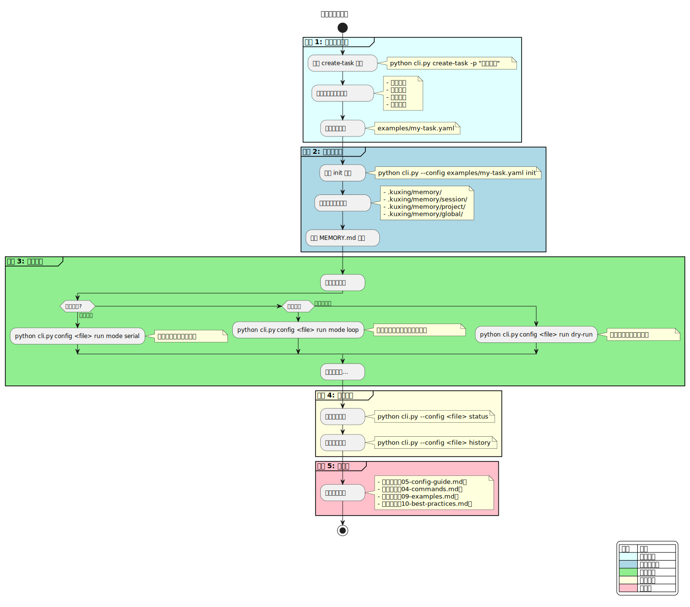

# 快速开始

## 5 分钟快速上手

本指南将帮助你在 5 分钟内运行第一个苦行僧任务。



**流程说明**：
1. **创建配置**：使用 `create-task` 命令交互式创建任务配置
2. **初始化项目**：运行 `init` 命令创建记忆目录结构
3. **运行任务**：选择执行模式（串行/循环/干运行）
4. **查看状态**：使用 `status` 和 `history` 命令查看执行情况
5. **下一步**：学习更多高级功能

---

## 前提条件

- Python 3.8+
- Claude CLI 已安装并配置
- 已完成[安装指南](./02-installation.md)

---

## 步骤 1：创建任务配置

使用 `create-task` 命令交互式创建配置：

```bash
cd /path/to/kuxing
python cli.py create-task -p "我的第一个任务"
```

**交互示例：**

```
🤖 创建任务: 我的第一个任务
==================================================

📂 代码路径（每行一个，输入空行结束）:
  路径: /home/user/myproject
  路径:

📄 文档路径（每行一个，输入空行结束）:
  路径: /home/user/myproject/docs
  路径:

📝 项目描述（可选）: 这是一个测试项目

🔐 是否需要保存账号信息？(y/n): n

⚙️  是否需要保存偏好设置？(y/n): n

🔄 最大轮次（默认50）: 10

🔄 正在生成配置和记忆文件...

✅ 已生成配置: /path/to/kuxing/examples/my-first-task.yaml
✅ 已生成项目记忆: /path/to/kuxing/memory/my-first-task/context.md
✅ 项目记忆已初始化

🚀 可以运行了：
   python cli.py --config examples/my-first-task.yaml run
```

---

## 步骤 2：手动创建配置（可选）

如果不使用交互命令，可以手动创建 YAML 配置：

```yaml
# examples/hello-world.yaml
project_name: "Hello World"
project_path: "/tmp/hello-world"
mode: "serial"  # serial | parallel | loop

tasks:
  - id: "task1"
    name: "创建文件"
    prompt: |
      在 /tmp/hello-world 目录下创建一个文件 hello.txt，
      内容为 "Hello from kuxing!"
    expected_output: "文件已创建"
    depends_on: []

  - id: "task2"
    name: "读取验证"
    prompt: |
      读取 /tmp/hello-world/hello.txt 的内容，
      验证内容是否正确
    expected_output: "内容验证通过"
    depends_on: ["task1"]
```

**配置说明：**

| 字段 | 必填 | 说明 |
|------|------|------|
| `project_name` | 是 | 项目名称 |
| `project_path` | 是 | 项目路径 |
| `mode` | 是 | 执行模式：serial/parallel/loop |
| `tasks` | 是 | 任务列表 |
| `tasks[].id` | 是 | 任务唯一标识 |
| `tasks[].prompt` | 是 | 执行 Prompt |
| `tasks[].depends_on` | 否 | 依赖的任务 ID |

---

## 步骤 3：初始化项目

```bash
python cli.py --config examples/hello-world.yaml init
```

**输出示例：**

```
初始化项目: Hello World
项目路径: /tmp/hello-world
执行模式: serial
任务数: 2

记忆目录: /path/to/kuxing/memory/hello-world
初始化完成！
```

---

## 步骤 4：运行任务

### 串行模式（Serial）

```bash
python cli.py --config examples/hello-world.yaml run
```

**输出示例：**

```
已更新配置: /path/to/kuxing/memory/hello-world/config.yaml

=== Round 1/50 ===
[10:30:01] 开始执行: task1 - 创建文件
[10:30:15] ✓ 完成: task1 - 创建文件
[10:30:15] 摘要: 创建了 /tmp/hello-world/hello.txt

=== Round 2/50 ===
[10:30:16] 开始执行: task2 - 读取验证
[10:30:25] ✓ 完成: task2 - 读取验证
[10:30:25] 摘要: 验证了文件内容

✅ 任务完成！ 失败: 0
```

### 循环模式（Loop）

循环模式会持续执行直到满足停止条件：

```bash
python cli.py --config examples/hello-world.yaml run --loop --max-rounds 100
```

**停止循环的方式：**

1. **自然停止**：达到 `max-rounds` 限制
2. **用户中断**：按 `Ctrl+C`
3. **自动停止**：满足配置中的停止条件

### 干运行模式（Dry Run）

不实际调用 Claude，只验证配置：

```bash
python cli.py --config examples/hello-world.yaml run --dry-run
```

---

## 步骤 5：查看状态和历史

### 查看状态

```bash
python cli.py --config examples/hello-world.yaml status
```

**输出示例：**

```
项目: Hello World
路径: /tmp/hello-world
模式: serial
当前轮次: 2

任务进度:
  总数: 2
  已完成: 2
  待处理: 0

执行轮次: 2
最后活动: 2026-04-03 10:30:25
```

### 查看历史

```bash
python cli.py --config examples/hello-world.yaml show --history
```

---

## 常用命令速查

| 命令                                   | 说明         |
| ------------------------------------ | ---------- |
| `python cli.py create-task -p "项目名"` | 交互式创建新任务   |
| `python cli.py --config <file> init` | 初始化项目      |
| `python cli.py run`                  | 运行任务（串行模式） |
| `python cli.py run --loop`           | 运行任务（循环模式） |
| `python cli.py status`               | 查看当前状态     |
| `python cli.py resume`               | 继续执行       |
| `python cli.py show --history`       | 显示历史记录     |
| `python cli.py reset`                | 重置状态       |

---

## 下一步

- [命令参考](./04-commands.md) - 完整命令文档
- [配置指南](./05-config-guide.md) - YAML 配置详解
- [调度器架构](./06-scheduler-architecture.md) - 内部工作原理

---

**最后更新**：2026-04-08
- [记忆架构](./07-memory-architecture.md) - 记忆系统详解
