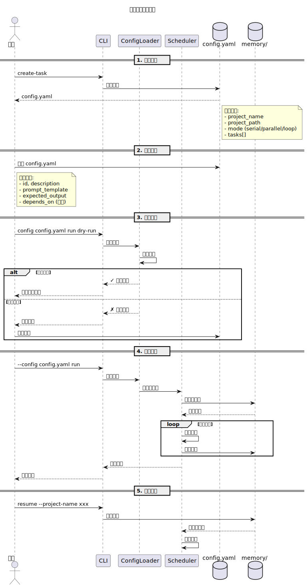

# 配置指南

## 配置概览

苦行僧使用 YAML 格式的配置文件来定义任务和执行行为。

### 配置工作流程

下图展示了从创建配置到执行任务的完整流程：



**流程说明**：
1. **创建配置**：使用 `create-task` 命令生成配置模板
2. **编辑配置**：根据需求编辑 config.yaml，定义任务和执行模式
3. **验证配置**：使用 `--dry-run` 模式验证配置正确性
4. **执行任务**：运行任务，系统自动管理记忆和状态
5. **恢复执行**：如果中断，可以使用 `resume` 命令继续执行

### 基本结构

```yaml
# 项目基本信息
project_name: "项目名称"
project_path: "/path/to/project"
description: "项目描述（可选）"

# 执行模式: serial | parallel | loop
mode: "serial"

# 任务配置
tasks:
  - id: "task-1"
    name: "任务名称"
    prompt: "执行提示"
    expected_output: "预期输出"
    depends_on: []

# 循环配置（mode=loop 时使用）
loop_config:
  task_id: "task-id"
  max_rounds: 50
  stop_condition: ""  # 可选
```

---

## 完整配置示例

### 串行模式（Serial）

```yaml
project_name: "文档整理项目"
project_path: "/home/user/docs"
description: "整理项目文档结构"

mode: "serial"

tasks:
  - id: "analyze"
    name: "分析文档结构"
    prompt: |
      分析 /home/user/docs 目录下的文档结构，
      生成一份文档清单，列出所有 .md 文件。
    expected_output: "文档清单，包含文件名和路径"
    depends_on: []

  - id: "categorize"
    name: "文档分类"
    prompt: |
      根据分析结果，将文档分为：
      1. 核心文档（README、INSTALL、ARCHITECTURE）
      2. 教程文档（GETTING_STARTED、GUIDE）
      3. 参考文档（API、CHANGELOG）
      4. 其他文档
    expected_output: "分类结果，每类文档列表"
    depends_on: ["analyze"]

  - id: "toc"
    name: "生成目录"
    prompt: |
      根据文档分类结果，
      为每个分类生成一份简要目录。
    expected_output: "分类目录"
    depends_on: ["categorize"]
```

### 并行模式（Parallel）

```yaml
project_name: "多项目并行"
project_path: "/home/user/workspace"
mode: "parallel"

tasks:
  - id: "project-a"
    name: "项目A分析"
    prompt: "分析 /home/user/workspace/project-a 的代码结构"
    expected_output: "项目A结构文档"
    depends_on: []

  - id: "project-b"
    name: "项目B分析"
    prompt: "分析 /home/user/workspace/project-b 的代码结构"
    expected_output: "项目B结构文档"
    depends_on: []

  - id: "project-c"
    name: "项目C分析"
    prompt: "分析 /home/user/workspace/project-c 的代码结构"
    expected_output: "项目C结构文档"
    depends_on: []
```

### 循环模式（Loop）

```yaml
project_name: "持续优化项目"
project_path: "/home/user/myproject"
mode: "loop"

tasks:
  - id: "optimize"
    name: "代码优化"
    prompt: |
      分析 /home/user/myproject 中的代码，
      找出可以优化的地方（性能、可读性、架构）。
      选择最关键的一个问题进行优化。
    expected_output: "优化报告和修改内容"
    depends_on: []

  - id: "verify"
    name: "验证优化"
    prompt: |
      运行测试验证优化是否正确，
      确保没有引入新问题。
    expected_output: "测试结果"
    depends_on: ["optimize"]

loop_config:
  task_id: "optimize"  # 循环执行的任务
  max_rounds: 100       # 最大轮次
```

---

## 字段详解

### 项目信息

#### `project_name`

项目名称，用于显示和标识。

| 属性 | 值 |
|------|------|
| 类型 | string |
| 必填 | 是 |
| 示例 | `"文档整理"` |

#### `project_path`

项目路径，Claude 执行任务时的工作目录。

| 属性 | 值 |
|------|------|
| 类型 | string |
| 必填 | 是 |
| 示例 | `"/home/user/project"` |

#### `description`

项目描述，可选。

| 属性 | 值 |
|------|------|
| 类型 | string |
| 必填 | 否 |

---

### 执行模式

#### `mode`

指定执行模式。

| 值 | 说明 |
|------|------|
| `serial` | 串行执行，按 `depends_on` 依赖顺序 |
| `parallel` | 并行执行，所有无依赖的任务同时执行 |
| `loop` | 循环执行，重复执行指定任务直到满足停止条件 |

---

### 任务配置

#### `tasks`

任务列表，每个任务定义一个执行单元。

```yaml
tasks:
  - id: "task-id"
    name: "显示名称"
    prompt: "执行提示（支持多行）"
    expected_output: "预期输出描述"
    depends_on: ["other-task-id"]  # 可选
```

##### `tasks[].id`

任务唯一标识符，用于 `depends_on` 引用。

| 属性 | 值 |
|------|------|
| 类型 | string |
| 必填 | 是 |
| 约束 | 同一配置中不可重复 |

##### `tasks[].name`

任务显示名称，用于日志和状态显示。

| 属性 | 值 |
|------|------|
| 类型 | string |
| 必填 | 是 |

##### `tasks[].prompt`

执行提示，定义 Claude 需要完成的任务。

| 属性 | 值 |
|------|------|
| 类型 | string（支持多行） |
| 必填 | 是 |
| 特性 | 支持环境变量 `${VAR_NAME}` |

**示例：**

```yaml
prompt: |
  分析 ${PROJECT_PATH} 目录下的代码结构。
  1. 列出所有源代码文件
  2. 识别主要模块
  3. 生成架构文档
```

##### `tasks[].expected_output`

预期输出描述，用于验证任务完成度。

| 属性 | 值 |
|------|------|
| 类型 | string |
| 必填 | 是 |

##### `tasks[].depends_on`

依赖任务列表。只有列表中的任务都完成后，当前任务才会开始。

| 属性 | 值 |
|------|------|
| 类型 | array of string |
| 必填 | 否 |
| 默认 | `[]`（无依赖） |

**示例：**

```yaml
# task-C 依赖 task-A 和 task-B
- id: "task-C"
  depends_on: ["task-A", "task-B"]
```

---

### 循环配置

当 `mode: "loop"` 时需要配置。

#### `loop_config`

```yaml
loop_config:
  task_id: "task-id"      # 要循环执行的任务 ID
  max_rounds: 50          # 最大轮次限制
  stop_condition: ""       # 可选停止条件
```

##### `loop_config.task_id`

指定循环执行的任务 ID。

##### `loop_config.max_rounds`

最大执行轮次，防止无限循环。

| 属性 | 值 |
|------|------|
| 类型 | integer |
| 默认 | 50 |

##### `loop_config.stop_condition`

可选停止条件，当条件满足时提前停止。

| 属性 | 值 |
|------|------|
| 类型 | string |
| 必填 | 否 |

---

## 环境变量

### 配置中使用

```yaml
tasks:
  - id: "build"
    prompt: |
      使用 ${ANDROID_SDK_HOME}/build-tools 构建项目
      SDK 版本: ${SDK_VERSION}
    expected_output: "构建成功"
```

### 引用格式

| 格式 | 说明 |
|------|------|
| `${VAR_NAME}` | 引用环境变量 |
| `$VAR_NAME` | 同上（部分系统） |

---

## 高级配置

### 多级依赖

```yaml
tasks:
  - id: "task-A"
  - id: "task-B"
    depends_on: ["task-A"]
  - id: "task-C"
    depends_on: ["task-B"]
  - id: "task-D"
    depends_on: ["task-A", "task-C"]
```

**执行顺序：** task-A → task-B → task-C → task-D

### 条件执行

通过设计 `depends_on` 实现条件执行：

```yaml
tasks:
  - id: "detect-os"
    # 检测操作系统，设置 flag

  - id: "linux-build"
    prompt: "Linux 构建..."
    depends_on: ["detect-os"]

  - id: "windows-build"
    prompt: "Windows 构建..."
    depends_on: ["detect-os"]
```

### 循环 + 串行结合

```yaml
mode: "loop"

tasks:
  - id: "collect-feedback"
    prompt: "收集用户反馈"
  - id: "analyze"
    prompt: "分析反馈"
    depends_on: ["collect-feedback"]

loop_config:
  task_id: "collect-feedback"
  max_rounds: 100
```

---

## 配置验证

### 自动验证

运行 `init` 或 `run` 时会自动验证配置：

```bash
python cli.py --config examples/my-config.yaml init
```

### 常见错误

**1. YAML 语法错误**

```yaml
# 错误：缩进不一致
tasks:
- id: "task1"    # 缩进错误
    name: "Task"

# 正确：
tasks:
  - id: "task1"
    name: "Task"
```

**2. 循环引用**

```yaml
# 错误：task-A 依赖 task-B，task-B 依赖 task-A
tasks:
  - id: "task-A"
    depends_on: ["task-B"]
  - id: "task-B"
    depends_on: ["task-A"]
```

**3. 引用不存在的任务**

```yaml
tasks:
  - id: "task-A"
  - id: "task-B"
    depends_on: ["task-C"]  # task-C 不存在
```

---

## 配置文件位置

苦行僧按以下顺序查找配置文件：

1. `--config` 命令行选项指定
2. `memory/<project-slug>/config.yaml`（上次运行保存的）
3. `examples/` 目录下第一个 `.yaml` 文件

---

## 下一步

- [调度器架构](./06-scheduler-architecture.md) - 内部工作原理

---

**最后更新**：2026-04-08
- [记忆架构](./07-memory-architecture.md) - 记忆系统详解
