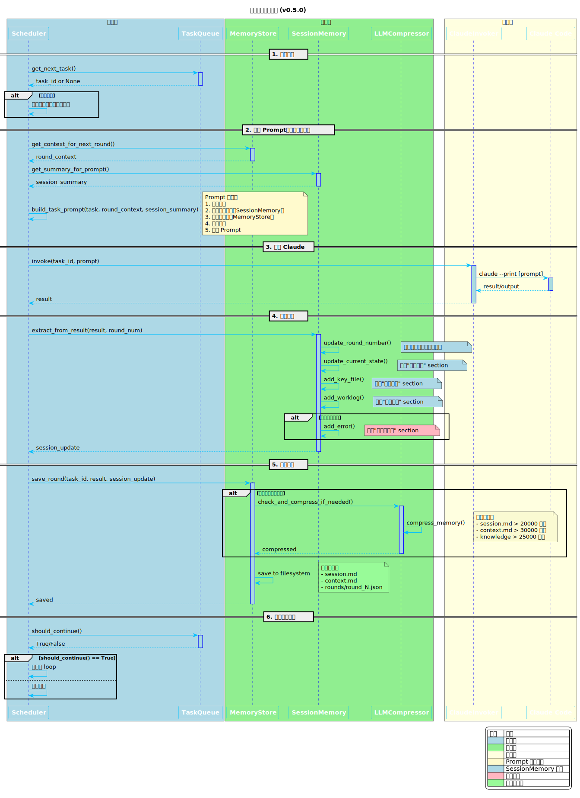
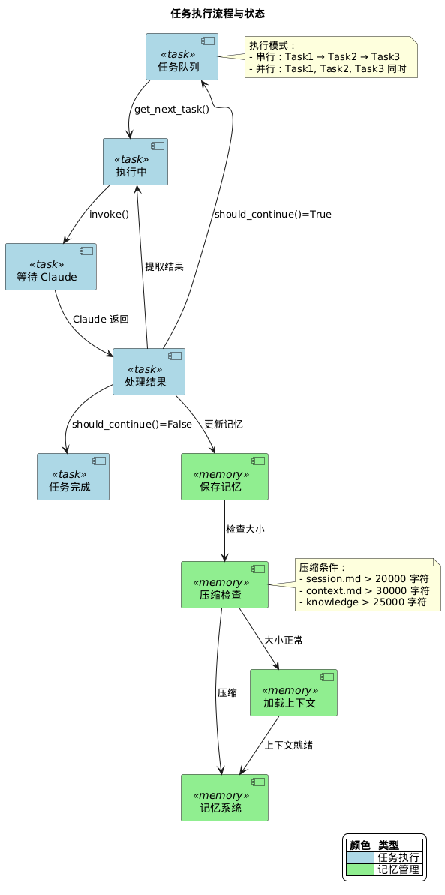

# 调度器架构

## 1. 概述

调度器（Scheduler）是 kuxing 的核心组件，负责协调所有组件执行多轮任务。它管理任务队列、记忆存储、Claude 调用，并确保每轮执行的上下文正确传递。

### 核心职责

- **任务调度**：管理任务队列，决定下一轮执行哪个任务
- **上下文管理**：聚合历史上下文、项目记忆、会话记忆
- **结果处理**：解析 Claude 输出，提取结果，更新记忆
- **状态持久化**：保存每轮状态，支持断点续传

---

## 2. 组件架构

### 2.1 核心组件关系

```
┌─────────────────────────────────────────────────────────────────┐
│                         Scheduler                                │
│                    (主调度器，协调整体流程)                        │
├─────────────────────────────────────────────────────────────────┤
│                                                                 │
│   ┌─────────────┐  ┌─────────────┐  ┌─────────────────────┐   │
│   │  TaskQueue  │  │MemoryStore  │  │  ClaudeInvoker      │   │
│   │  (任务队列)  │  │ (记忆存储)  │  │  (Claude 调用)      │   │
│   └──────┬──────┘  └──────┬──────┘  └──────────┬──────────┘   │
│          │               │                    │               │
│          ▼               ▼                    ▼               │
│   ┌─────────────┐  ┌─────────────┐  ┌─────────────────────┐   │
│   │Serial│Parallel│  │SessionMemory│  │   LLMCompressor   │   │
│   │ Loop │       │  │(会话记忆)   │  │   (记忆压缩)       │   │
│   └─────────────┘  └─────────────┘  └─────────────────────┘   │
│                          │                                     │
│                          ▼                                     │
│                   ┌─────────────┐                              │
│                   │MemoryUpdater│                              │
│                   │(自动记忆更新)│                              │
│                   └─────────────┘                              │
│                                                                 │
└─────────────────────────────────────────────────────────────────┘
```

### 2.2 组件职责

| 组件 | 职责 | 关键方法 |
|------|------|----------|
| **Scheduler** | 主调度器，协调各组件 | `run_single_round()`, `initialize()` |
| **TaskQueue** | 任务队列管理 | `get_next_task()`, `should_continue()` |
| **MemoryStore** | 记忆存储持久化 | `save_round()`, `get_context_for_next_round()` |
| **SessionMemory** | 结构化会话记忆 | `extract_from_result()`, `get_summary_for_prompt()` |
| **MemoryUpdater** | 自动记忆更新 | `update_from_result()` |
| **LLMCompressor** | LLM 智能压缩 | `compress_memory()`, `check_and_compress_if_needed()` |
| **ClaudeInvoker** | Claude API 调用 | `invoke()` |

---

## 3. 执行流程

### 3.1 单轮执行流程

```
┌─────────────────────────────────────────────────────────────────┐
│                      单轮执行流程 (v0.5.0)                          │
├─────────────────────────────────────────────────────────────────┤
│                                                                 │
│  1. 获取下一个任务                                                │
│     ┌─────────────┐                                             │
│     │  TaskQueue  │ ──► get_next_task() ──► task_id             │
│     └─────────────┘                                             │
│                            │                                     │
│                            ▼                                     │
│  2. 构建 Prompt（注入三层上下文）                                  │
│     ┌─────────────┐  ┌─────────────┐  ┌─────────────────────┐   │
│     │Round Context│  │Full Context │  │ Session Summary     │   │
│     │ (历史摘要)   │  │(项目+全局)  │  │ (会话记忆摘要)      │   │
│     └──────┬──────┘  └──────┬──────┘  └──────────┬──────────┘   │
│            │                │                    │               │
│            └────────────────┼────────────────────┘               │
│                             ▼                                    │
│                    ┌─────────────┐                               │
│                    │build_task_  │                               │
│                    │prompt()     │                               │
│                    └──────┬──────┘                               │
│                           │                                       │
│                           ▼                                       │
│  3. 调用 Claude                                                         │
│     ┌─────────────┐                                             │
│     │ClaudeInvoker│ ──► invoke() ──► result/output               │
│     └─────────────┘                                             │
│                           │                                       │
│                           ▼                                       │
│  4. 处理结果                                                       │
│     ┌─────────────┐  ┌─────────────┐  ┌─────────────────────┐   │
│     │extract_     │  │ MemoryUpdater│  │ SessionMemory      │   │
│     │result()     │  │update_      │  │ extract_            │   │
│     └──────┬──────┘  │ from_result()│  │ from_result()      │   │
│            │         └──────┬──────┘  └──────────┬──────────┘   │
│            │                │                    │               │
│            └────────────────┼────────────────────┘               │
│                             ▼                                    │
│                    ┌─────────────┐                               │
│                    │check_and_   │                               │
│                    │compress()   │                               │
│                    └──────┬──────┘                               │
│                           │                                       │
│                           ▼                                       │
│  5. 保存状态                                                        │
│     ┌─────────────┐  ┌─────────────┐                            │
│     │ save_round()│  │ save_state()│                            │
│     └─────────────┘  └─────────────┘                            │
│                                                                 │
└─────────────────────────────────────────────────────────────────┘
```

> **提示**：以下为 ASCII 简化版流程图，详细交互时序请参考 PlantUML 序列图。



*图 3-1: 调度器执行序列图，展示 Scheduler 与 TaskQueue、MemoryStore、ClaudeInvoker 的完整交互流程*

### 3.2 会话记忆更新流程 (v0.5.0)

```
┌─────────────────────────────────────────────────────────────────┐
│                   会话记忆更新流程 (v0.5.0)                        │
├─────────────────────────────────────────────────────────────────┤
│                                                                 │
│  Claude 执行完成                                                  │
│        │                                                         │
│        ▼                                                         │
│  ┌─────────────────────────────────────────────────────────┐    │
│  │  SessionMemory.extract_from_result(result, round_num)   │    │
│  └─────────────────────────────────────────────────────────┘    │
│        │                                                         │
│        ├──► update_round_number(round_num)                      │
│        │    更新执行标题中的轮次号                                │
│        │                                                         │
│        ├──► update_current_state(summary, next_hints)           │
│        │    更新"当前状态" section                               │
│        │    ├─ 上一轮完成内容                                    │
│        │    └─ 下一步计划                                       │
│        │                                                         │
│        ├──► add_key_file(file_path, description)               │
│        │    添加"关键文件" section                               │
│        │    ├─ files_modified → "已修改"                        │
│        │    └─ files_created → "新创建"                        │
│        │                                                         │
│        ├──► add_worklog(description)                            │
│        │    添加"工作日志" section                               │
│        │                                                         │
│        └──► add_error() if 包含 "错误"/"失败"                   │
│             更新"错误与修正" section                              │
│                                                                 │
│        ▼                                                         │
│  ┌─────────────────────────────────────────────────────────┐    │
│  │  MemoryStore.check_and_compress_if_needed()            │    │
│  └─────────────────────────────────────────────────────────┘    │
│        │                                                         │
│        ▼                                                         │
│  ┌─────────────────────────────────────────────────────────┐    │
│  │  LLMCompressor.compress_memory()                        │    │
│  │  ├─ session.md > 20000 字符 → 压缩到约 20000           │    │
│  │  ├─ context.md > 30000 字符 → 压缩到约 30000           │    │
│  │  └─ knowledge > 25000 字符 → 压缩到约 25000            │    │
│  └─────────────────────────────────────────────────────────┘    │
│                                                                 │
└─────────────────────────────────────────────────────────────────┘
```

### 3.3 MEMORY.md 索引更新 (v0.5.0)

```
┌─────────────────────────────────────────────────────────────────┐
│                   MEMORY.md 索引更新流程                         │
├─────────────────────────────────────────────────────────────────┤
│                                                                 │
│  初始化项目时                                                    │
│        │                                                         │
│        ▼                                                         │
│  ┌─────────────────────────────────────────────────────────┐    │
│  │  MemoryStore.create_memory_index()                     │    │
│  │  └─ 创建 MEMORY.md 索引文件，包含所有记忆文件引用        │    │
│  └─────────────────────────────────────────────────────────┘    │
│        │                                                         │
│        ▼                                                         │
│  会话开始时                                                      │
│        │                                                         │
│        ▼                                                         │
│  ┌─────────────────────────────────────────────────────────┐    │
│  │  SessionMemory.initialize()                             │    │
│  │      │                                                  │    │
│  │      ▼                                                  │    │
│  │  MemoryStore.update_memory_index()                      │    │
│  │  └─ 更新"会话记忆" section，添加当前会话条目             │    │
│  └─────────────────────────────────────────────────────────┘    │
│        │                                                         │
│        ▼                                                         │
│  每轮执行完成后                                                  │
│        │                                                         │
│        ▼                                                         │
│  ┌─────────────────────────────────────────────────────────┐    │
│  │  SessionMemory.extract_from_result()                     │    │
│  │      │                                                  │    │
│  │      ▼                                                  │    │
│  │  自动更新 MEMORY.md 中相关 section 的描述               │    │
│  └─────────────────────────────────────────────────────────┘    │
│                                                                 │
└─────────────────────────────────────────────────────────────────┘
```

### 3.4 Prompt 构建集成 (v0.5.0)

每轮 Prompt 构建时，`SessionMemory.get_summary_for_prompt()` 被集成到第三层上下文：

```
┌─────────────────────────────────────────────────────────────────┐
│                Prompt 构建（三层上下文 + 会话摘要）                 │
├─────────────────────────────────────────────────────────────────┤
│                                                                 │
│  ## 本轮任务                                                     │
│  [任务描述和预期输出]                                             │
│                                                                 │
│  ─────────────────────────────────────────────────────────────  │
│                                                                 │
│  ## 会话记忆摘要 (SessionMemory.get_summary_for_prompt)          │
│  ├─ 当前状态 ←─── 最重要，每轮更新                              │
│  ├─ 任务规格                                                    │
│  ├─ 关键文件                                                    │
│  └─ 最近的错误                                                  │
│                                                                 │
│  ─────────────────────────────────────────────────────────────  │
│                                                                 │
│  ## 历史上下文 (MemoryStore.get_context_for_next_round)          │
│  ├─ Round 1: ✅ 任务描述                                        │
│  │   - 修改文件: xxx                                           │
│  │   - 结果: xxx                                               │
│  ├─ Round 2: ✅ 任务描述                                        │
│  │   - 修改文件: yyy                                           │
│  │   - 结果: yyy                                               │
│  └─ ...                                                         │
│                                                                 │
│  ─────────────────────────────────────────────────────────────  │
│                                                                 │
│  ## 项目背景 (MemoryStore.get_full_context)                      │
│  ├─ 知识沉淀 (最低优先级)                                        │
│  ├─ 全局共享记忆                                                │
│  └─ 项目私有记忆 (最高优先级)                                    │
│                                                                 │
│  ─────────────────────────────────────────────────────────────  │
│                                                                 │
│  ## 执行 Prompt                                                  │
│  [用户提供的执行指令]                                            │
│                                                                 │
└─────────────────────────────────────────────────────────────────┘
```

### 3.5 自动记忆更新流程

```
┌─────────────────────────────────────────────────────────────────┐
│                     自动记忆更新流程                              │
├─────────────────────────────────────────────────────────────────┤
│                                                                 │
│  每轮 Claude 执行完成后                                          │
│        │                                                         │
│        ▼                                                         │
│  ┌─────────────────────────────────────────────────────────┐    │
│  │  MemoryUpdater.update_from_result(result)               │    │
│  │  ├─ 提取 files_modified → 更新 context.md              │    │
│  │  ├─ 提取 files_created → 更新 context.md               │    │
│  │  ├─ 提取命令 → 添加到工作流程                            │    │
│  │  └─ 提取错误 → 更新知识沉淀                              │    │
│  └─────────────────────────────────────────────────────────┘    │
│        │                                                         │
│        ▼                                                         │
│  ┌─────────────────────────────────────────────────────────┐    │
│  │  SessionMemory.extract_from_result(result, round_num)   │    │
│  │  └─ 同步更新 session.md（10 个 section）                │    │
│  └─────────────────────────────────────────────────────────┘    │
│                                                                 │
└─────────────────────────────────────────────────────────────────┘
```

---

## 4. Prompt 构建

### 4.1 三层上下文注入

每轮 Prompt 包含三层上下文（按优先级排序）：

```
┌─────────────────────────────────────────────────────────────────┐
│                    Prompt 结构（三层上下文）                       │
├─────────────────────────────────────────────────────────────────┤
│                                                                 │
│  ## 本轮任务                                                     │
│  [任务描述和预期输出]                                             │
│                                                                 │
│  ─────────────────────────────────────────────────────────────  │
│                                                                 │
│  ## 会话记忆摘要 (SessionMemory.get_summary_for_prompt)          │
│  ├─ 当前状态                                                    │
│  ├─ 任务规格                                                    │
│  ├─ 关键文件                                                    │
│  └─ 最近的错误                                                  │
│                                                                 │
│  ─────────────────────────────────────────────────────────────  │
│                                                                 │
│  ## 历史上下文 (MemoryStore.get_context_for_next_round)          │
│  ├─ Round 1: ✅ 任务描述                                        │
│  │   - 修改文件: xxx                                           │
│  │   - 结果: xxx                                               │
│  ├─ Round 2: ✅ 任务描述                                        │
│  │   - 修改文件: yyy                                           │
│  │   - 结果: yyy                                               │
│  └─ ...                                                         │
│                                                                 │
│  ─────────────────────────────────────────────────────────────  │
│                                                                 │
│  ## 项目背景 (MemoryStore.get_full_context)                      │
│  ├─ 知识沉淀 (最低优先级)                                        │
│  ├─ 全局共享记忆                                                │
│  └─ 项目私有记忆 (最高优先级)                                    │
│                                                                 │
│  ─────────────────────────────────────────────────────────────  │
│                                                                 │
│  ## 执行 Prompt                                                  │
│  [用户提供的执行指令]                                            │
│                                                                 │
└─────────────────────────────────────────────────────────────────┘
```

### 4.2 get_summary_for_prompt() 集成

`SessionMemory.get_summary_for_prompt()` 方法从 session.md 中提取关键信息用于 Prompt 构建：

```python
def get_summary_for_prompt(self) -> str:
    """获取用于 prompt 的摘要"""
    current_state = self.get_section_content("当前状态")
    task_spec = self.get_section_content("任务规格")
    key_files = self.get_section_content("关键文件")
    errors = self.get_section_content("错误与修正")

    summary = "## 会话记忆摘要\n\n"

    if current_state:
        summary += f"### 当前状态\n{current_state}\n\n"

    if task_spec:
        summary += f"### 任务规格\n{task_spec}\n\n"

    if key_files:
        summary += f"### 关键文件\n{key_files}\n\n"

    if errors:
        # 只显示最近的错误（最后20行）
        error_lines = errors.split('\n')
        recent_errors = '\n'.join(error_lines[-20:])
        summary += f"### 最近的错误\n{recent_errors}\n\n"

    return summary
```

**Prompt 中的输出格式**：

```markdown
## 会话记忆摘要

### 当前状态
**上一轮完成**：
本轮完成了核心文档的扩展完善工作：
- 更新 docs/01-overview.md
- 创建 docs/02-installation.md (4.7KB)

**下一步计划**：
继续完善 docs/03-quick-start.md 和 docs/04-commands.md

**更新时间**：2026-04-03 15:30:00

### 任务规格
用户要求完善 kuxing 项目文档，包括：
- 项目概览
- 安装指南
- 快速开始
- 命令参考

### 关键文件
- `docs/01-overview.md` — 项目概览
- `docs/02-installation.md` — 安装指南

### 最近的错误
**错误**：plantuml 命令未找到
**解决方法**：已添加到系统 PATH
```

### 4.3 优先级设计

```
高优先级 ← → 低优先级

┌─────────────────────────────────────────────────────────────────┐
│                                                                 │
│  项目私有记忆 (context.md)         ───► 最高优先级                │
│  ├─ SDK 路径                                                  │
│  ├─ 项目特定配置                                              │
│  └─ 已知问题                                                   │
│                                                                 │
│  会话记忆摘要 (session.md)         ───► 中等优先级               │
│  ├─ 当前状态                                                   │
│  └─ 任务规格                                                   │
│                                                                 │
│  历史上下文 (rounds/*.json)       ───► 中等优先级               │
│  └─ 每轮摘要                                                   │
│                                                                 │
│  全局共享记忆 (shared_context/)   ───► 较低优先级               │
│  └─ 跨项目共享信息                                          │
│                                                                 │
│  知识沉淀 (knowledge_base.md)     ───► 最低优先级               │
│  └─ 历史经验                                                   │
│                                                                 │
└─────────────────────────────────────────────────────────────────┘
```

---

## 5. 状态管理

### 5.1 SchedulerState

```python
@dataclass
class SchedulerState:
    project_slug: str          # 项目标识符
    project_name: str          # 项目名称
    project_path: str          # 项目路径
    config_file: str          # 配置文件路径
    current_round: int        # 当前轮次
    mode: str                 # 执行模式 (serial/parallel/loop)
    tasks: Dict[str, TaskState]  # 所有任务状态
    pending_tasks: List[str]  # 待执行任务 ID 列表
    completed_rounds: List[int]  # 已完成轮次列表
    last_error: Optional[str] # 最后错误信息
```

### 5.2 RoundState

```python
@dataclass
class RoundState:
    round: int                       # 轮次号
    timestamp: str                   # ISO 时间戳
    task_id: str                     # 任务 ID
    task_description: str            # 任务描述
    input_context: Dict              # 输入上下文
    claude_invocation: Optional[Dict]  # Claude 调用记录
    result: Dict                    # 执行结果
```

---

## 6. 循环模式执行

### 6.1 循环模式流程

```
┌─────────────────────────────────────────────────────────────────┐
│                      循环模式执行流程                             │
├─────────────────────────────────────────────────────────────────┤
│                                                                 │
│  1. 检查首轮任务 (first_task)                                    │
│     ┌─────────────┐                                             │
│     │ 首次执行?   │ ──► Yes ──► 执行首轮任务 ──► 跳过 get_next_task│
│     └─────────────┘                                             │
│            │                                                    │
│            No                                                   │
│            ▼                                                    │
│  2. 主循环                                                      │
│     ┌─────────────────────────────────────────────────────────┐ │
│     │  while should_continue():                               │ │
│     │    │                                                   │ │
│     │    ├──► get_next_task() ──► task_id                   │ │
│     │    │                                                   │ │
│     │    ├──► run_single_round()                             │ │
│     │    │                                                   │ │
│     │    ├──► consecutive_success++ / reset                   │ │
│     │    │                                                   │ │
│     │    └──► 检查停止条件: 连续 N 次成功?                     │ │
│     └─────────────────────────────────────────────────────────┘ │
│                                                                 │
│  3. 停止条件                                                    │
│     ├─ 所有任务完成                                             │
│     ├─ 达到 max_rounds                                         │
│     ├─ 串行模式任务失败                                         │
│     └─ 循环模式：连续 N 次成功                                   │
│                                                                 │
└─────────────────────────────────────────────────────────────────┘
```

> **提示**：以下为 ASCII 简化版流程图，详细任务状态流转请参考 PlantUML 流程图。



*图 6-1: 任务执行流程与状态图，展示任务在队列、执行、等待、完成的完整生命周期*

---

## 7. 日志系统

### 7.1 日志结构

```
memory/{project}/
├── logs/
│   └── run_{timestamp}.log    # 完整执行日志
├── rounds/
│   ├── round_0001.json         # 第 1 轮记忆
│   ├── round_0002.json         # 第 2 轮记忆
│   └── ...
└── state.json                  # 当前状态
```

### 7.2 日志级别

| 级别 | 用途 | 输出位置 |
|------|------|----------|
| DEBUG | 完整 Prompt、Claude 输出 | 文件 |
| INFO | 执行进度、结果摘要 | 控制台 + 文件 |
| WARNING | 可恢复错误 | 控制台 + 文件 |
| ERROR | 严重错误 | 控制台 + 文件 |

---

**最后更新**：2026-04-08
**版本**：v0.5.1
